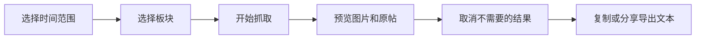

# MagnetCatcher

  

  
  
  
  

MagnetCatcher 是一个 Android 端磁力链接整理工具。它把论坛新帖抓取、图片预览、原帖跳转、链接去重和 115 批量导出放在同一个移动端流程里，让原本需要反复打开网页、筛选帖子、复制链接的操作变得更快。

如果你只是想直接使用，下载 Release 里的 APK 就可以安装，不需要配置开发环境。

  

## 获取安装包

推荐直接使用 Release 包：

1. 打开 [Releases](https://github.com/tttt123445/sehuatang_apk_search/releases)。
2. 下载 `magnet-catcher.apk`。
3. 在 Android 设备上允许安装未知来源应用。
4. 安装后打开「磁力抓取 新版」。

当前公开包面向 `arm64-v8a` 设备，要求 Android 7.0 或更高版本。

## 为什么值得下载

| 场景 | MagnetCatcher 帮你做什么 |
| --- | --- |
| 只想看新帖 | 直接按今天、昨天、近 7 天或自定义日期抓取，减少翻页和重复查找。 |
| 想先筛再导出 | 结果列表里可以看标题、摘要和图片，先取消不需要的内容，再统一导出。 |
| 经常复制磁力 | 自动提取并去重磁力链接，按批次生成文本，减少手工复制出错。 |
| 手机端操作为主 | 抓取、预览、打开原帖、复制和分享都在 Android App 内完成。 |
| 网络环境不稳定 | 支持系统 VPN/直连和内置 XTunnel 两种模式，失败时可回退。 |

## 功能亮点

| 能力 | 说明 |
| --- | --- |
| 时间抓取 | 支持今天、昨天、近 7 天和自定义起始日期，适合按发帖时间筛选新内容。 |
| 板块选择 | 内置常用板块，选择结果会自动保存，下次打开继续使用。 |
| 帖子解析 | 先解析列表页，再进入帖子页提取标题、发布时间、摘要、磁力链接和图片地址。 |
| 图片预览 | 支持缩略图、图片预览、上一张/下一张、失败重试和原帖跳转。 |
| 批量导出 | 自动去重磁力链接，并按每批 50 条生成文本，便于复制或分享到 115。 |
| 网络模式 | 默认使用系统 VPN/直连，也可启用内置 XTunnel；异常时会回退到系统网络。 |
| 本地缓存 | 保存最近抓取结果、Cookie、用户设置和图片缓存，减少重复操作。 |

## 使用流程

1. 选择抓取时间范围，例如今天、昨天、近 7 天或自定义日期。
2. 选择需要关注的板块。
3. 点击开始抓取，等待列表页和帖子页解析完成。
4. 在结果列表中预览图片、打开原帖或取消不需要的帖子。
5. 使用复制到 115 或分享导出生成磁力文本。

## Release 包优势

- 预构建 APK，下载后即可安装，省去配置开发环境的时间。
- 已集成抓取、图片预览、原帖跳转、磁力去重和分享导出流程。
- 当前版本适合在手机上快速验证和日常整理，不需要手动运行脚本。
- 更新时只需要下载最新 Release 包覆盖安装。
- Release 附件会提供 APK 和压缩包，方便按自己的习惯下载保存。

## 安装后建议

1. 首次打开后先选择常用板块，应用会记住你的选择。
2. 如果只想抓当天内容，保持默认时间范围即可。
3. 需要更稳的访问环境时，优先使用系统 VPN/直连；如果网络不可用，再切换内置 XTunnel。
4. 抓取完成后先预览图片和原帖，取消不需要的帖子，再复制或分享导出。
5. 如果结果为空，先检查网络模式、Cookie 状态和目标站点是否能正常打开。

## 常见问题

**需要自己编译吗？**

不需要。普通用户下载 `magnet-catcher.apk` 直接安装即可。

**为什么安装时会提示未知来源？**

这是 Android 对非应用商店 APK 的通用提示。请只从本仓库 Release 页面下载。

**为什么只支持 arm64-v8a？**

当前公开 APK 面向主流 64 位 Android 设备打包，后续可以按需要扩展更多 ABI。

**会上传我的本地数据吗？**

应用的设置、Cookie、图片缓存和最近抓取结果保存在 Android 应用本地存储中。仓库不包含本地 Cookie、代理配置、构建缓存或个人路径。

## 隐私与边界

- 仓库不包含本地 Cookie、代理配置、构建缓存或个人路径。
- 应用设置、Cookie、图片缓存和最近抓取结果保存在 Android 应用本地存储中。
- 使用前请确认目标站点规则、当地法律法规和个人使用场景允许该行为。
- 如果抓取失败，优先检查网络模式、系统 VPN/代理状态和 Cookie 是否可用。
