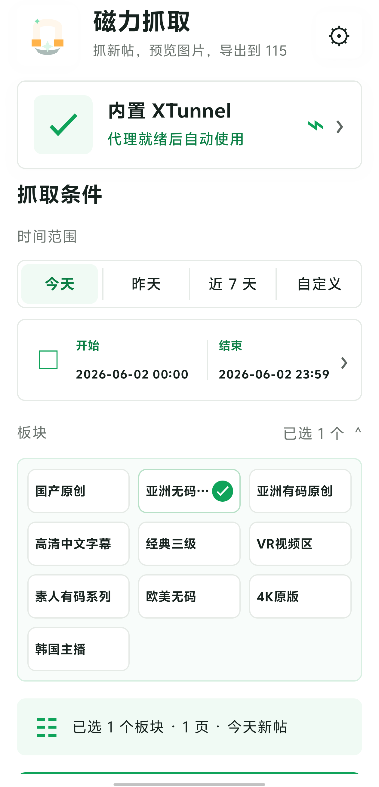
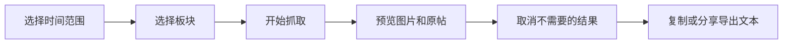

# MagnetCatcher

<p align="center">
  <a href="https://github.com/tttt123445/sehuatang_apk_search/releases"></a>
</p>

<p align="center">
  
  
  
  
</p>

MagnetCatcher 是一个 Android 端磁力链接整理工具。它把论坛新帖抓取、图片预览、原帖跳转、链接去重和 115 批量导出放在同一个移动端流程里，适合需要在手机上快速筛选并整理磁力文本的场景。

本仓库提供可直接安装的 APK Release 包，也开放 Kotlin、Jetpack Compose、OkHttp 和 NDK/JNI 相关源码，方便审阅、学习和二次开发。

<p align="center">
  
</p>

## 获取安装包

推荐直接使用 Release 包：

1. 打开 [Releases](https://github.com/tttt123445/sehuatang_apk_search/releases)。
2. 下载 `magnet-catcher.apk`。
3. 在 Android 设备上允许安装未知来源应用。
4. 安装后打开「磁力抓取 新版」。

当前公开包面向 `arm64-v8a` 设备，要求 Android 7.0 或更高版本。

## 功能亮点

| 能力 | 说明 |
| --- | --- |
| 时间抓取 | 支持今天、昨天、近 7 天和自定义起始日期，适合按发帖时间筛选新内容。 |
| 板块选择 | 内置常用板块，选择结果会自动保存，下次打开继续使用。 |
| 帖子解析 | 先解析列表页，再进入帖子页提取标题、发布时间、摘要、磁力链接和图片地址。 |
| 图片预览 | 支持缩略图、图片预览、上一张/下一张、失败重试和原帖跳转。 |
| 批量导出 | 自动去重磁力链接，并按每批 50 条生成文本，便于复制或分享到 115。 |
| 网络模式 | 默认使用系统 VPN/直连，也可启用内置 XTunnel；异常时会回退到系统网络。 |
| 本地缓存 | 保存最近抓取结果、Cookie、用户设置和图片缓存，减少重复操作。 |

## 使用流程



1. 选择抓取时间范围，例如今天、昨天、近 7 天或自定义日期。
2. 选择需要关注的板块。
3. 点击开始抓取，等待列表页和帖子页解析完成。
4. 在结果列表中预览图片、打开原帖或取消不需要的帖子。
5. 使用复制到 115 或分享导出生成磁力文本。

## 技术栈

- Kotlin + Jetpack Compose：负责 Android 原生界面和状态管理。
- OkHttp + Kotlin Coroutines：负责抓取请求、图片请求、重试和并发调度。
- Coil：负责图片加载与缓存展示。
- SharedPreferences + 本地 JSON：保存设置、Cookie 和最近结果。
- NDK/JNI：桥接内置 XTunnel 运行时。
- Gradle Android Plugin：管理单模块 Android 工程构建。

## 源码构建

只想安装使用时，建议下载 Release APK。源码构建适合需要审阅代码、修改逻辑或自行打包的开发者。

```bash
git clone https://github.com/tttt123445/sehuatang_apk_search.git
cd sehuatang_apk_search
./gradlew :app:test
./gradlew :app:assembleDebug
```

本地构建前需要准备 Android SDK、NDK，并放置 XTunnel 运行所需的本地文件：

```text
out/apk-inspect/xtunnel/extract/lib/arm64-v8a/libgo.so
out/apk-inspect/xtunnel/extract/assets/flutter_assets/assets/embed.data
```

这些文件属于本机打包依赖，不会提交到 GitHub。仓库中的 `.gitignore` 已经忽略本地构建产物、缓存、密钥和 release 输出目录。

## 项目结构

```text
.
├── app/                  # Android 应用模块
├── docs/                 # 截图、设计稿和验证素材
├── gradle/               # Gradle Wrapper 与版本目录
├── openspec/             # 功能变更记录和规格说明
├── build.gradle.kts      # 根工程构建配置
├── settings.gradle.kts   # Gradle 仓库和模块配置
└── README.md             # 公开项目说明
```

核心业务代码位于 `app/src/main/kotlin/com/example/magnetcatcher/`，按 `data`、`domain`、`network`、`parser`、`ui` 和 `xtunnel` 分层组织。

## 隐私与边界

- 仓库不包含本地 Cookie、代理配置、构建缓存或个人路径。
- 应用设置、Cookie、图片缓存和最近抓取结果保存在 Android 应用本地存储中。
- 使用前请确认目标站点规则、当地法律法规和个人使用场景允许该行为。
- 如果抓取失败，优先检查网络模式、系统 VPN/代理状态和 Cookie 是否可用。
