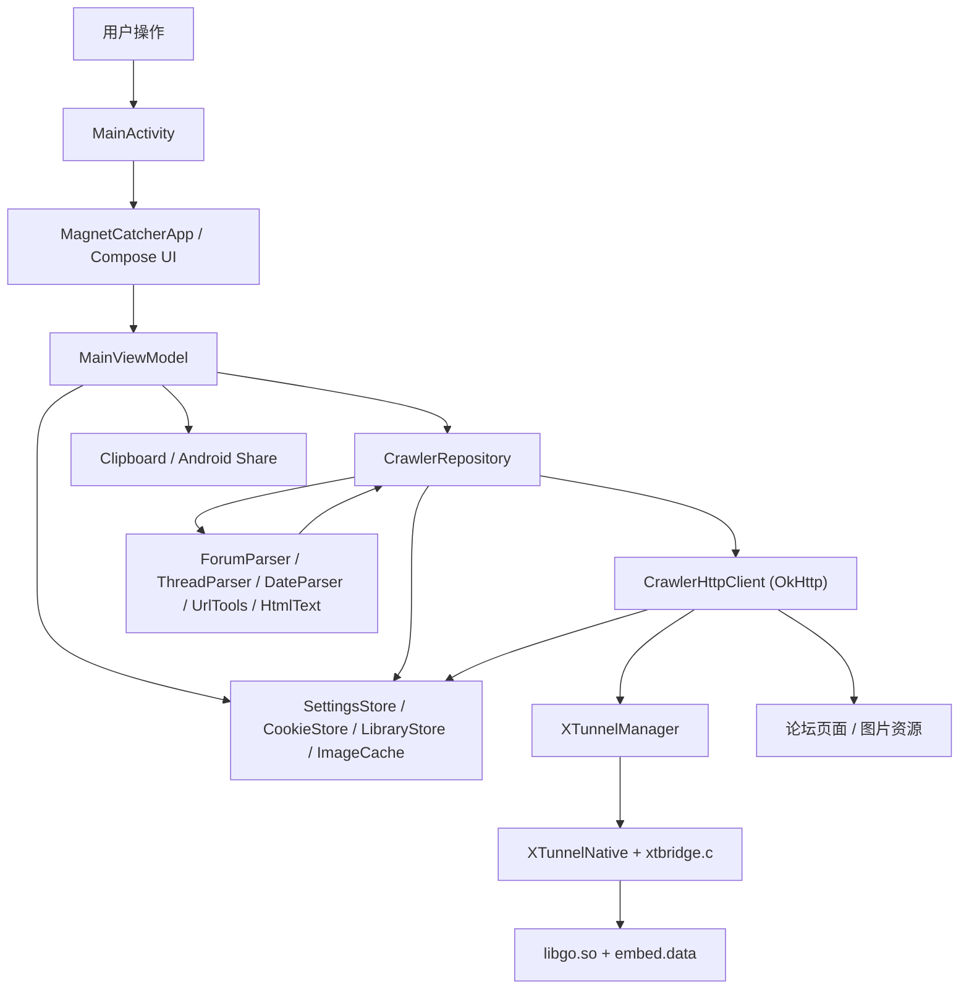

# MagnetCatcher

`MagnetCatcher` 是一个 Android Gradle + Kotlin + Jetpack Compose 应用，用于在手机端选择论坛板块、按发帖时间抓取新帖、预览帖子图片、打开原帖，并导出可供 115 批量导入的磁力文本。

当前仓库已经迁移到标准 Android 单模块工程：根目录只负责 Gradle 配置，业务代码集中在 `app/` 模块。旧的 `android_app/` Java 工程已经移除，后续构建和维护都以 `./gradlew :app:assembleDebug` 为准。

## 运行截图


## 核心能力

- 板块选择：内置常用 BT 区板块，并持久化用户选择。
- 时间抓取：支持今天、昨天、近 7 天和自定义起始日期。
- 帖子解析：抓取列表页，再并发进入帖子页解析标题、发布时间、磁力和图片。
- 图片体验：结果缩略图、全屏预览、上一张/下一张、失败重试和原帖跳转。
- 导出流程：所选磁力去重后按批次复制或通过 Android 分享导出。
- 网络模式：默认使用系统 VPN/直连，可选启用内置 XTunnel，本地代理就绪后才切换。
- 本地缓存：保存最近抓取结果、Cookie、用户设置和图片缓存。

## 架构图



## 项目结构

```text
.
├── README.md
├── build.gradle.kts
├── settings.gradle.kts
├── gradlew
├── gradle/
├── app/
│   ├── build.gradle.kts
│   └── src/
│       ├── main/
│       │   ├── AndroidManifest.xml
│       │   ├── jni/
│       │   ├── kotlin/com/example/magnetcatcher/
│       │   └── res/
│       └── test/kotlin/com/example/magnetcatcher/
├── docs/
└── openspec/
```

## 文件作用

### 根目录

| 文件 | 作用 |
| --- | --- |
| `README.md` | 项目说明、架构图、运行截图、构建方式和文件清单。 |
| `.gitignore` | 忽略本地密钥、构建产物、Gradle 缓存、release 输出和临时文件。 |
| `settings.gradle.kts` | 定义 Gradle 插件仓库、依赖仓库、根工程名 `MagnetCatcher`，并引入 `:app` 模块。 |
| `build.gradle.kts` | 根工程 Gradle 配置，声明 Android、Compose 和 Kotlin 插件版本入口。 |
| `gradlew` | Gradle Wrapper 启动脚本，用于在本机执行构建和测试。 |
| `gradle/libs.versions.toml` | 统一管理 AGP、Kotlin、Compose、OkHttp、Coil、JUnit 等依赖版本。 |
| `gradle/wrapper/gradle-wrapper.properties` | Gradle Wrapper 的发行版和下载配置。 |

### Android 应用模块

| 文件 | 作用 |
| --- | --- |
| `app/build.gradle.kts` | Android 应用模块配置，声明 SDK/NDK、Compose、依赖、JNI 构建和 XTunnel 本地文件复制任务。 |
| `app/src/main/AndroidManifest.xml` | Android 清单文件，声明网络权限、外部浏览器查询、应用图标、主题和 `MainActivity`。 |
| `app/src/main/jni/Android.mk` | NDK build 配置，编译 `xtbridge` JNI 动态库。 |
| `app/src/main/jni/Application.mk` | NDK ABI 和最低平台配置，目前只构建 `arm64-v8a`。 |
| `app/src/main/jni/xtbridge.c` | JNI 桥接代码，通过 `dlopen/dlsym` 调用 XTunnel `libgo.so` 暴露的启动、停止、状态和配置函数。 |

### Kotlin 入口和常量

| 文件 | 作用 |
| --- | --- |
| `app/src/main/kotlin/com/example/magnetcatcher/MainActivity.kt` | Android Activity 入口，加载 Compose UI，并处理 Toast、复制、分享和外部打开链接事件。 |
| `app/src/main/kotlin/com/example/magnetcatcher/AppConstants.kt` | 全局常量，包括基础 URL、直连 URL、超时、代理端口、导出批大小、缩略图尺寸和 XTunnel 参数。 |

### 数据模型

| 文件 | 作用 |
| --- | --- |
| `app/src/main/kotlin/com/example/magnetcatcher/model/Models.kt` | 定义板块、帖子引用、抓取结果项、导出批次、抓取请求和失败统计等业务模型。 |
| `app/src/main/kotlin/com/example/magnetcatcher/model/StatusUpdate.kt` | 定义状态提示的等级和状态卡片更新数据。 |

### 数据存储

| 文件 | 作用 |
| --- | --- |
| `app/src/main/kotlin/com/example/magnetcatcher/data/SettingsStore.kt` | 基于 `SharedPreferences` 保存网络模式、代理端口、抓取页数、起始时间、板块选择和板块列表。 |
| `app/src/main/kotlin/com/example/magnetcatcher/data/CookieStore.kt` | 保存并拼装 HTTP Cookie，供抓取请求和 WebView 原帖打开复用。 |
| `app/src/main/kotlin/com/example/magnetcatcher/data/LibraryStore.kt` | 将最近抓取到的帖子列表保存到应用私有目录 `library.json`，启动时恢复结果。 |
| `app/src/main/kotlin/com/example/magnetcatcher/data/ImageCache.kt` | 图片内存缓存和磁盘缓存，支持采样解码，并用临时文件避免写入半截缓存。 |

### 业务和网络

| 文件 | 作用 |
| --- | --- |
| `app/src/main/kotlin/com/example/magnetcatcher/domain/CrawlerRepository.kt` | 抓取主流程：检查访问、构造列表页 URL、解析帖子引用、并发抓取帖子详情、按时间过滤并保存结果。 |
| `app/src/main/kotlin/com/example/magnetcatcher/domain/ExportFormatter.kt` | 将所选帖子里的磁力去重、分页分批，生成复制或分享给 115 的纯文本。 |
| `app/src/main/kotlin/com/example/magnetcatcher/network/CrawlerHttpClient.kt` | OkHttp 封装，负责 HTML 和图片请求、默认请求头、Cookie 收集、重试、响应大小限制和代理切换。 |
| `app/src/main/kotlin/com/example/magnetcatcher/network/HttpRuntime.kt` | 定义 Cookie 存储和代理控制接口，降低网络层对具体存储/XTunnel 实现的耦合。 |

### HTML/URL 解析

| 文件 | 作用 |
| --- | --- |
| `app/src/main/kotlin/com/example/magnetcatcher/parser/ForumParser.kt` | 解析论坛列表页里的帖子链接、标题、发布时间和置顶状态，也能从移动端 JSON 中提取板块列表。 |
| `app/src/main/kotlin/com/example/magnetcatcher/parser/ThreadParser.kt` | 解析帖子页标题、发布时间、正文摘要、磁力链接和图片地址。 |
| `app/src/main/kotlin/com/example/magnetcatcher/parser/DateParser.kt` | 统一处理 `2026-06-02 00:00`、今天/昨天/前天、几分钟前等时间格式，并转换为上海时区时间戳。 |
| `app/src/main/kotlin/com/example/magnetcatcher/parser/HtmlText.kt` | HTML 文本清洗、实体解码、正则首匹配、整数解析和磁力链接规范化工具。 |
| `app/src/main/kotlin/com/example/magnetcatcher/parser/UrlTools.kt` | URL 绝对化、原帖直连域名转换、图片候选 URL 生成和 thread id 提取。 |

### Compose UI

| 文件 | 作用 |
| --- | --- |
| `app/src/main/kotlin/com/example/magnetcatcher/ui/MagnetCatcherApp.kt` | Compose 应用根组件，配置 Material 主题，收集弹窗状态并挂载主界面、预览、原帖 WebView 和日期选择器。 |
| `app/src/main/kotlin/com/example/magnetcatcher/ui/MainScreen.kt` | 主屏幕布局，组合顶部标题、网络卡片、抓取条件、结果概览、开发者选项和帖子列表。 |
| `app/src/main/kotlin/com/example/magnetcatcher/ui/MainViewModel.kt` | UI 状态和交互中枢，负责设置保存、抓取任务、XTunnel 预热、图片预览、原帖打开、复制和分享事件。 |
| `app/src/main/kotlin/com/example/magnetcatcher/ui/MainUiState.kt` | 主界面、网络面板、抓取面板、结果面板、开发者面板和弹窗的 UI state 定义。 |
| `app/src/main/kotlin/com/example/magnetcatcher/ui/CapturePanel.kt` | 抓取条件区域，包括时间范围分段控件、日期选择、板块选择和开始抓取按钮。 |
| `app/src/main/kotlin/com/example/magnetcatcher/ui/ResultsPanel.kt` | 结果概览、开发者选项、导出按钮、帖子卡片、缩略图加载和结果统计。 |
| `app/src/main/kotlin/com/example/magnetcatcher/ui/Dialogs.kt` | 图片预览弹窗、原帖 WebView 弹窗、Cookie 注入和 WebView 代理覆盖。 |
| `app/src/main/kotlin/com/example/magnetcatcher/ui/CommonUi.kt` | 复用的卡片、标签和数字输入框组件。 |
| `app/src/main/kotlin/com/example/magnetcatcher/ui/ThreadWebViewConfig.kt` | 原帖 WebView 的代理规则、Cookie 目标域和 Cookie header 拆分逻辑。 |

### XTunnel

| 文件 | 作用 |
| --- | --- |
| `app/src/main/kotlin/com/example/magnetcatcher/xtunnel/XTunnelNative.kt` | 加载 `libgo.so` 和 `libxtbridge.so`，声明 JNI external 方法。 |
| `app/src/main/kotlin/com/example/magnetcatcher/xtunnel/XTunnelManager.kt` | 管理内置 XTunnel 生命周期、单飞启动、端口健康检查、失败冷却、代理对象和直连回退提示。 |

### Android 资源

| 文件 | 作用 |
| --- | --- |
| `app/src/main/res/drawable/ic_magnet_logo.xml` | 应用内顶部展示的磁力 Logo 矢量图。 |
| `app/src/main/res/drawable/ic_launcher_foreground.xml` | 启动图标前景矢量资源。 |
| `app/src/main/res/values/colors.xml` | Android 图标和主题相关颜色。 |
| `app/src/main/res/values/styles.xml` | 应用主题样式，关闭 ActionBar 并适配 Compose Activity。 |
| `app/src/main/res/mipmap-anydpi/ic_launcher.xml` | 自适应启动图标配置。 |
| `app/src/main/res/mipmap-anydpi/ic_launcher_round.xml` | 自适应圆形启动图标配置。 |
| `app/src/main/res/mipmap-anydpi-v26/ic_launcher.xml` | Android 8.0+ 自适应启动图标配置。 |
| `app/src/main/res/mipmap-anydpi-v26/ic_launcher_round.xml` | Android 8.0+ 圆形自适应启动图标配置。 |

### 单元测试

| 文件 | 作用 |
| --- | --- |
| `app/src/test/kotlin/com/example/magnetcatcher/domain/ExportFormatterTest.kt` | 覆盖磁力去重和批次导出行为。 |
| `app/src/test/kotlin/com/example/magnetcatcher/network/CrawlerHttpClientTest.kt` | 覆盖请求头、Cookie 收集、默认 Referer 和 HTML 响应大小限制。 |
| `app/src/test/kotlin/com/example/magnetcatcher/parser/DateParserTest.kt` | 覆盖中文日期规范化、相对时间解析和预设起始时间。 |
| `app/src/test/kotlin/com/example/magnetcatcher/parser/ForumParserTest.kt` | 覆盖列表页帖子解析和移动端 JSON 板块解析。 |
| `app/src/test/kotlin/com/example/magnetcatcher/parser/ThreadParserTest.kt` | 覆盖帖子标题、磁力、图片和标题兜底解析。 |
| `app/src/test/kotlin/com/example/magnetcatcher/ui/ThreadWebViewConfigTest.kt` | 覆盖 WebView Cookie 目标域、Cookie 拆分和代理开关规则。 |

### 文档和截图

| 文件 | 作用 |
| --- | --- |
| `docs/mockups/android-ui-redesign-half.svg` | Android UI 改版过程中的半屏设计稿。 |
| `docs/screenshots/android-ui-current.png` | 当前主界面状态截图。 |
| `docs/screenshots/android-ui-date-picker.png` | 日期选择器运行截图。 |
| `docs/screenshots/android-ui-final-installed.png` | APK 安装后验证截图。 |
| `docs/screenshots/android-ui-final-running.png` | README 中使用的最终运行截图。 |
| `docs/screenshots/android-ui-fixed-final.png` | 修复后的最终主界面截图。 |
| `docs/screenshots/android-ui-fixed-running.png` | 修复后的运行状态截图。 |
| `docs/screenshots/android-ui-forum-collapsed.png` | 板块折叠状态截图。 |
| `docs/screenshots/android-ui-interactions.png` | 交互状态验证截图。 |
| `docs/screenshots/android-ui-network-system.png` | 系统 VPN/直连网络模式截图。 |
| `docs/screenshots/android-ui-network-toggle.png` | 网络模式切换截图。 |
| `docs/screenshots/android-ui-selection-restored.png` | 帖子/板块选择恢复状态截图。 |

### OpenSpec 记录

| 文件 | 作用 |
| --- | --- |
| `openspec/changes/optimize-android-crawl-ux/proposal.md` | 记录 Android 抓取体验优化的目标、范围和成功标准。 |
| `openspec/changes/optimize-android-crawl-ux/design.md` | 记录迁移到 Gradle/Compose、XTunnel 启动、代理回退和图片缓存等设计决策。 |
| `openspec/changes/optimize-android-crawl-ux/tasks.md` | 跟踪迁移、修复、构建和真机验证任务。 |
| `openspec/changes/optimize-android-crawl-ux/specs/android-crawler/spec.md` | 行为规格增量，描述 XTunnel 就绪、忙碌状态、结果统计和图片预览等要求。 |

### 本地忽略文件

这些文件只用于本机开发或构建，不会提交到 Git：

| 路径 | 作用 |
| --- | --- |
| `.secrets/` | 本地 Cookie、代理或其他敏感配置。 |
| `out/` | 本地 APK 分析、XTunnel 提取文件、release 包和临时产物。 |
| `.gradle/`、`.kotlin/` | Gradle/Kotlin 本地缓存。 |
| `app/build/` | Android 构建产物。 |
| `core`、`coverage.out`、`*.test` | 本地调试、崩溃和测试产物。 |
| `local.properties` | Android SDK 本机路径配置。 |

## 构建 APK

构建前需要本机已经配置 Android SDK/NDK，并准备好从 XTunnel APK 提取出的本地文件：

```text
out/apk-inspect/xtunnel/extract/lib/arm64-v8a/libgo.so
out/apk-inspect/xtunnel/extract/assets/flutter_assets/assets/embed.data
```

这些文件只用于本地打包，已经被 `.gitignore` 忽略，不会上传到 GitHub。

执行构建：

```sh
./gradlew :app:assembleDebug
```

构建完成后输出：

```text
app/build/outputs/apk/debug/app-debug.apk
```

## 安装和运行

通过 ADB 安装：

```sh
adb install -r app/build/outputs/apk/debug/app-debug.apk
```

运行后按以下流程使用：

1. 打开应用「磁力抓取 新版」。
2. 默认使用系统 VPN/直连；如需内置代理，在开发者选项中启用 XTunnel。
3. 选择抓取时间范围和板块。
4. 点击「开始抓取」。
5. 在结果列表中预览图片、打开原帖，取消不需要的帖子。
6. 点击「复制到 115」或「分享/导出」。

## 常用命令

```sh
./gradlew :app:testDebugUnitTest
./gradlew :app:assembleDebug
```
